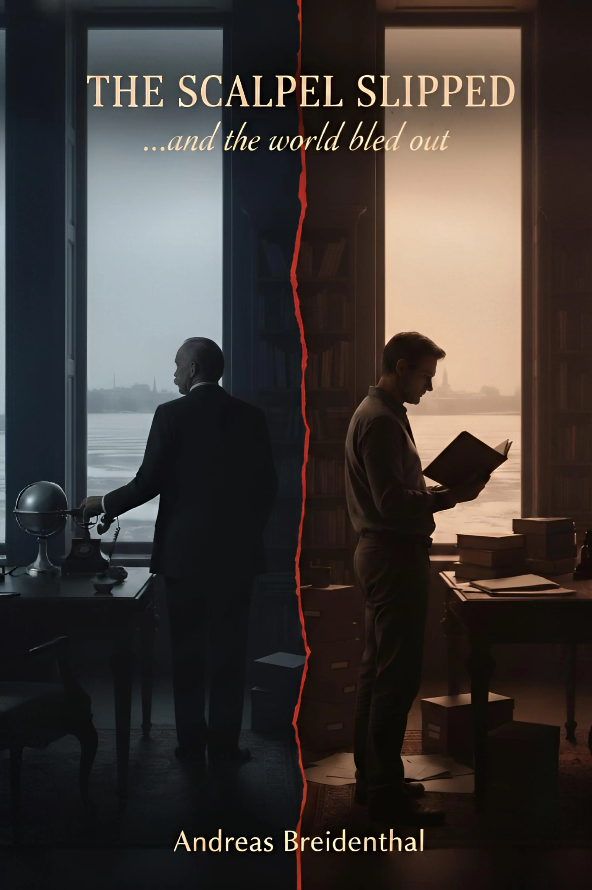

Andreas Breidenthal
# The Scalpel Slipped
**_…and the world bled out_**

> *"A higher power has restored that order which I could not maintain."*  
> <cite>— Emperor Franz Josef, 29th June 1914</cite>

*A novel in three parts*

---

*The Scalpel Slipped* follows Russian Foreign Minister Sergei Sazonov across three decades — from the winter night in 1912 when he began mapping Europe's fracture lines, through the catastrophe of 1914, to his exile and death in Nice in 1927.

In 2025, a doctoral researcher finds a leather-bound notebook in a second-hand bookshop in Provence. What it contains rewrites how the Great War began — and forces him to choose between silence and speech.

*This is a work of fiction. All intelligence reports, private documents, and internal correspondence depicted are invented. No institution referenced endorses this work.*

[Begin Reading →](ch01.html)

## Part I · Positioning
*St. Petersburg, 1912–1914*

1. [**The Telegram**](ch01.html)  
   *St. Petersburg, 28th June 1914*
2. [**Architecture**](ch02.html)  
   *St. Petersburg, 14th February 1912*
3. [**The Keystone**](ch03.html)  
   *St. Petersburg, January 1914*
4. [**The First Reports**](ch04.html)  
   *St. Petersburg, March–April 1914*
5. [**The Silence**](ch05.html)  
   *St. Petersburg, May–June 1914*
6. [**The Ultimatum**](ch06.html)  
   *St. Petersburg, 24th July 1914*
7. [**The Cascade**](ch07.html)  
   *St. Petersburg / Tsarskoye Selo, 24th July – 30th July 1914*

## Part II · Reckoning
*Russia and Exile, 1916–1927*

8. [**Dismissal**](ch08.html)  
   *Tsarskoye Selo, 10th July 1916*
9. [**Flight**](ch09.html)  
   *Petrograd / Southern Russia, February–October 1917*
10. [**Exile**](ch10.html)  
    *Paris / Nice, 1919–1925*
11. [**The Memoirs**](ch11.html)  
    *Nice, January–August 1925*
12. [**The Interview**](ch12.html)  
    *Nice, October 1926*
13. [**The Death**](ch13.html)  
    *Nice, 25th December 1927*
* [**Epilogue: The Silence**](epilogue-1.html)

## Part III · Discovery
*France, Russia, Austria, 2025–2026*

14. [**The Bookshop**](ch14.html)  
    *Saint-Paul-de-Vence, France, June 2025*
15. [**Authentication**](ch15.html)  
    *Paris, June–July 2025*
16. [**Moscow**](ch16.html)  
    *Russian State Archive, July 2025*
17. [**Vienna**](ch17.html)  
    *Austrian State Archive, August 2025*
18. [**The Choice**](ch18.html)  
    *Paris, September 2025*
* [**Epilogue: Six Months Later**](epilogue-2.html)  
  *March 2026*

## Closing Matter

* [**Historical Note**](historical-note.html)  
  *What is documented · What is invented*
